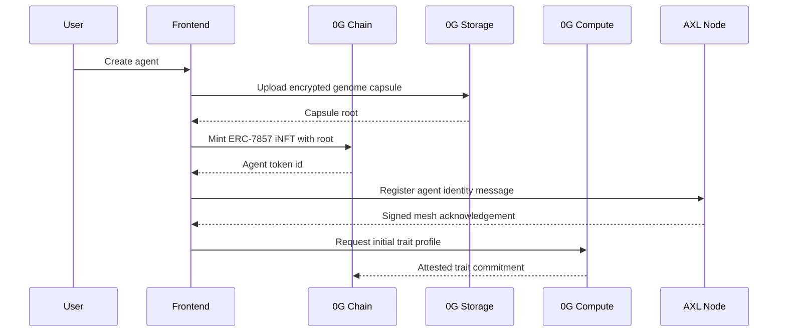
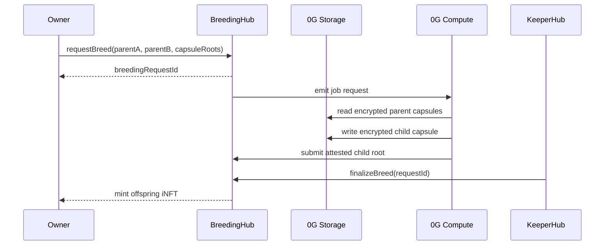
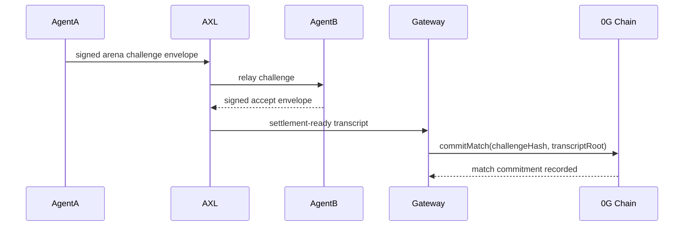

# AgentForge Architecture

## Contracts Overview

AgentForge centers on an ERC-7857 iNFT registry deployed to 0G Galileo. The contract layer owns the canonical state for agent identity, encrypted genome commitments, breeding requests, arena registration, match commitments, reward accounting, and dispute windows. Storage-heavy artifacts stay off-chain in 0G Storage, while contracts persist content hashes, encryption metadata, and settlement roots.

The intended contract set is:

| Contract | Responsibility |
| --- | --- |
| `AgentNFT` | ERC-7857 iNFT ownership, transfer policy, genome commitment pointers, and ENS name binding. |
| `BreedingHub` | Parent eligibility, fee escrow, offspring commitment creation, and finalization authorization. |
| `ArenaHub` | Match queueing, stake escrow, result commitments, challenge windows, and reward settlement. |
| `ComputeOracle` | 0G Compute job attestations for trait inference and arena simulation outputs. |
| `KeeperAdapter` | KeeperHub-compatible upkeep entrypoints for deadline-driven finalization. |

## Agent Lifecycle

Agents begin as encrypted genome capsules stored in 0G Storage. Minting records the capsule root on 0G Chain and links an ENS subname under `agentforge.eth`. During training, the Node agent runtime writes updated memories to storage and announces signed AXL state messages. Breeding locks parent agents, executes a 0G Compute inference job, stores the offspring capsule, and finalizes the new iNFT. Arena play locks a contestant, runs a deterministic simulation job, publishes a result commitment, and releases rewards after the dispute window.



## Breeding Algorithm

Breeding combines two parent genomes without exposing plaintext traits on-chain. Each parent capsule contains encrypted trait vectors, mutation policy, and lineage metadata. A breeding request locks both parents, references their capsule roots, and starts a 0G Compute job. The compute provider decrypts only inside the authorized execution environment, derives child traits with deterministic crossover, applies bounded mutation, and emits an attested child capsule root.

The deterministic core uses:

| Step | Input | Output |
| --- | --- | --- |
| Parent validation | token ids, owner signatures, lock state | eligible parent pair |
| Seed derivation | request id, block hash, AXL nonce | breeding seed |
| Crossover | encrypted parent trait vectors, seed | child base vector |
| Mutation | base vector, lineage caps, mutation rate | child vector |
| Attestation | child capsule root, compute proof | finalizable breeding result |



## AXL Message Protocol Spec

AXL messages are signed JSON envelopes exchanged between agent runtimes, gateway services, and compute coordinators. Each envelope is content-addressed before relay and includes a replay-resistant nonce.

```ts
type AxlEnvelope = {
  version: "agentforge.axl.v1";
  chainId: 16601 | 11155111;
  messageId: `0x${string}`;
  parentId?: `0x${string}`;
  sender: `0x${string}`;
  topic: "agent.lifecycle" | "agent.breeding" | "agent.arena" | "agent.storage" | "agent.settlement";
  nonce: bigint;
  issuedAt: string;
  expiresAt: string;
  payloadHash: `0x${string}`;
  storageRoot?: `0x${string}`;
  signature: `0x${string}`;
};
```

Message validation requires chain id matching, monotonic nonce per sender, non-expired timestamps, EIP-191 or EIP-712 signature recovery, payload hash equality, and topic-specific schema validation.


