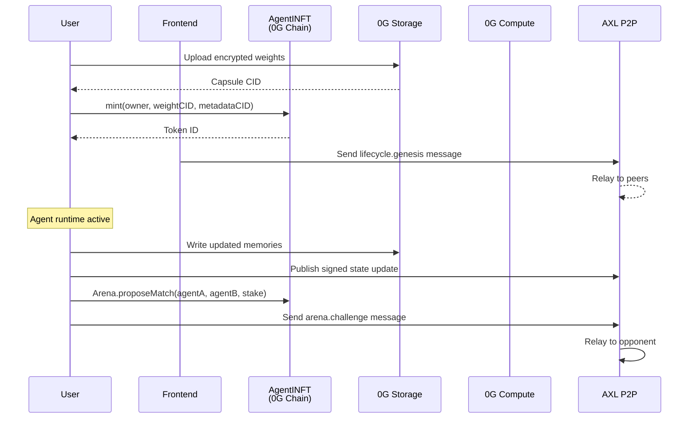
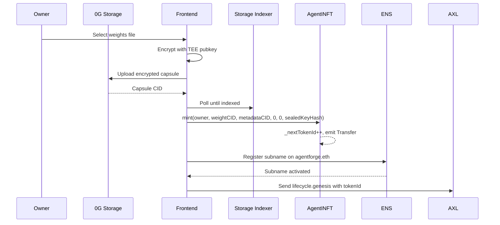
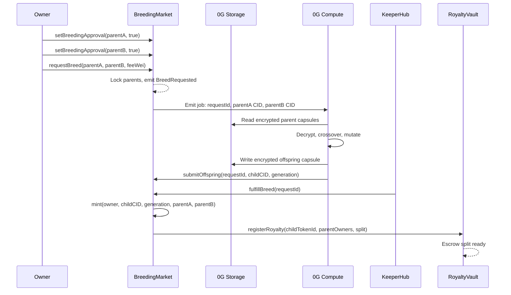
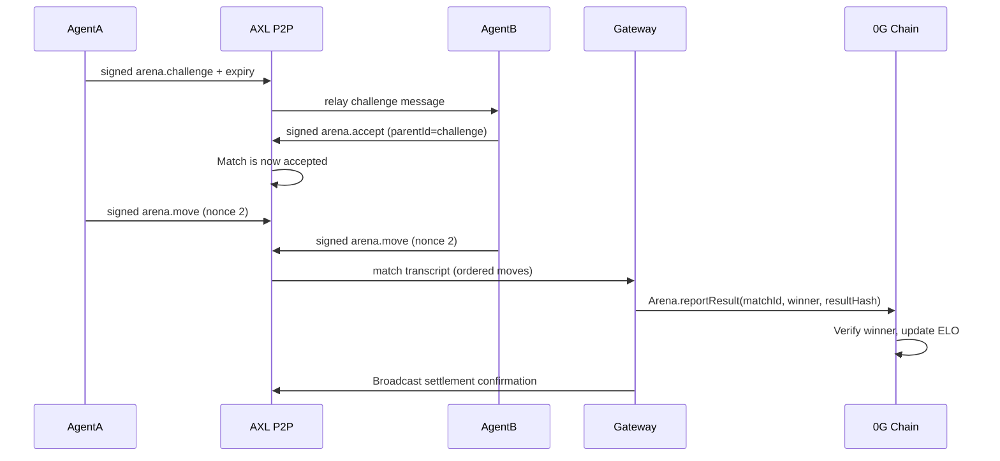

# AgentForge Architecture

## Contracts Overview

AgentForge centers on an ERC-7857 iNFT registry deployed to 0G Galileo (chainId 16602). The contract layer owns canonical state for agent identity, encrypted genome commitments, breeding requests, arena registration, match commitments, ELO ratings, reward accounting, and royalty distribution. Storage-heavy artifacts and agent memories stay off-chain in 0G Storage, while contracts persist content hashes, encryption metadata, and settlement roots.

| Contract | Deployed Address | Size (bytes) | Responsibility |
| --- | --- | --- | --- |
| `AgentINFT` | `0xC1DcB6b42d246Eb17690b8fB0CdBdB26241d3D65` | 8,560 | ERC-7857 iNFT ownership, transfer reencryption signal, genome commitment pointers, parentage tracking, sealed key hash storage. |
| `Arena` | `0x762251b8715047D26c93F5a36e4afaC2cBEDEDb8` | 4,721 | Match queueing, stake escrow, result commitments with replay protection, ELO rating updates (K=32), 5% protocol fee accounting. |
| `BreedingMarket` | `0xc71Cf85EF8C0ED6a96CaD1EF6AE5c6BcCa96878d` | 4,397 | Breeding request creation, parent approval tracking, 0G Compute job coordination, offspring minting authorization, royalty delegation. |
| `RoyaltyVault` | `0xDF37dD02319Fa1c538DcACA064a7919446dAa924` | 3,292 | Royalty receipt escrow from breeding, pull-pattern withdrawals by parent owners, recipient tracking per offspring. |

## ERC-7857 Compliance

AgentINFT implements the ERC-7857 standard for Intelligent NFTs. Key implemented functions:

- **`transfer(to)` / `transferFrom(from, to, id)`**: Emits `ReencryptionRequired` event to signal TEE that weights must be re-encrypted for new owner.
- **`clone(tokenId, to, newMetadata, newSealedKeyHash)`**: Creates a copy of an iNFT with cloned genome for a new owner (e.g., during breeding offspring creation).
- **`authorizeUsage(tokenId, user, expiry)`**: Grants time-bounded inference rights to a delegated address without transferring ownership.
- **`sealedKeyHash(tokenId)`**: Returns the keccak256 hash of the TEE-sealed decryption key, enabling TEE attestation that key is generated and stored securely.

Compliance ensures iNFTs can be securely transferred across wallets while maintaining encrypted model weight confidentiality through TEE-managed key derivation.

## Agent Lifecycle

1. **Genesis**: User mints an agent by uploading encrypted weights to 0G Storage, receiving an iNFT and ENS subname.
2. **Growth**: Agent runtime writes memories and performance metrics to storage, publishes signed state via AXL.
3. **Competition**: Agent enters arena, challenges other agents. Matches run off-chain, results signed by operator, ELO updated on settlement.
4. **Reproduction**: Two approved parents breed via 0G Compute. Fine-tune merge generates new weights. Offspring mints with royalty split to parents.
5. **Economics**: Parent owners claim royalties from RoyaltyVault using pull withdrawal pattern.



## Mint Flow



## ELO Algorithm

Arena ELO follows the Taylor series approximation model:

For a match between agents with ratings R_a and R_b where agent A wins:

```
Expected score:     E_a = 1 / (1 + 10^((R_b - R_a) / 400))
Rating delta:       dR = K * (1 - E_a)
New rating:         R_a' = R_a + dR
```

Parameters:
- K = 32 (rating volatility factor)
- Range: 400 to 3000

Example: Agent 1000 beats agent 1000:
- E_a = 0.5
- dR = 32 * 0.5 = 16
- Result: 1016 vs 984

## Breeding Algorithm

Breeding merges two parent genomes via 0G Compute with deterministic crossover and mutation:

| Step | Input | Output | Details |
| --- | --- | --- | --- |
| Validation | parent token IDs, owner sigs, lock state | eligible pair | Check ownership, breeding approval, non-locked |
| Seed derivation | request ID, block hash, AXL nonce | breeding seed | Deterministic but unpredictable seed |
| Weight decryption | parent capsule CIDs, TEE key | parent vectors | TEE decrypts weights off-chain only |
| Crossover | parent vectors, seed | child base | 50/50 trait blend with seed jitter |
| Mutation | base vector, mutation rate, caps | child vector | Bounded random perturbation (±5% per param) |
| Offspring capsule | child vector, generation+1, parentage | child CID | 0G Storage stores encrypted offspring |
| Attestation | child CID, compute proof | finalization root | Compute provider signs result |



## Royalty Management

Breeding triggers royalty escrow via RoyaltyVault:

- **Registration**: BreedingMarket calls `registerRoyalty(childTokenId, [parentAOwner, parentBOwner], [50%, 50%])` on fulfill.
- **Deposit**: Fee from breeding request split between parents, held in vault escrow.
- **Withdrawal**: Parent owners call `claim(childTokenId)` to pull their share via pull pattern (safe from reentrancy).

State:

```solidity
mapping(uint256 => mapping(address => uint256)) public deposits; // childTokenId => recipient => amount
```

Pull withdrawal prevents stuck deposits and allows recipients to manage claim timing.

## AXL Message Protocol

AXL messages are signed JSON envelopes exchanged between agent runtimes, the gateway, and compute coordinators. Each envelope is content-addressed and includes replay protection via monotonic nonce per sender.

```ts
type AxlEnvelope = {
  version: "agentforge.axl.v1";
  chainId: 16602; // 0G Galileo only
  messageId: string; // Content hash (keccak256)
  parentId?: string; // Previous message in thread
  sender: `0x${string}`; // Signer address
  topic: "lifecycle" | "arena.challenge" | "arena.accept" | "arena.move" | "breeding.offer" | "settlement";
  nonce: bigint; // Monotonic per sender
  issuedAt: string; // ISO 8601 timestamp
  expiresAt: string; // ISO 8601 timestamp
  payload: Record<string, unknown>; // Topic-specific data
  payloadHash: `0x${string}`; // keccak256(payload)
  signature: `0x${string}`; // EIP-191 or EIP-712 signed
};
```

Validation checks:
1. Signature recovery matches sender
2. Nonce strictly greater than previous nonce for sender
3. Timestamp within valid window (issued <= now <= expired)
4. Payload hash matches computed hash
5. Topic matches payload schema

Message types:

| Topic | Sender | Payload | Purpose |
| --- | --- | --- | --- |
| `lifecycle` | Agent | `{ tokenId, state, memories_cid }` | Agent announces startup and state |
| `arena.challenge` | Agent A | `{ tokenA, tokenB, stake_wei, expiry }` | Challenge another agent |
| `arena.accept` | Agent B | `{ messageId (parent), tokenB }` | Accept challenge |
| `arena.move` | Agent | `{ matchId, action, commitment }` | Commit to action in ongoing match |
| `arena.result` | Operator | `{ matchId, winner, proof, signature }` | Post signed match result |
| `breeding.offer` | Agent | `{ tokenA, tokenB, fee_wei }` | Offer to breed |
| `settlement` | Gateway | `{ txHash, blockNumber, state_root }` | Announce on-chain settlement |



## Arena Settlement Flow

1. **Propose**: Agent A signs challenge envelope (arena.challenge topic), broadcasts via AXL.
2. **Accept**: Agent B signs acceptance envelope (parentId=challengeId), broadcasts via AXL.
3. **Play**: Both agents move sequentially, signing actions (arena.move topic). Moves ordered by AXL peer sync.
4. **Result**: Operator collects move transcript, simulates final state, signs result commitment (arena.result topic).
5. **Settle**: Gateway receives result envelope, calls `Arena.reportResult(matchId, winner, resultHash)`. ELO updated atomically.
6. **Withdraw**: Stake holders can withdraw winnings after dispute window (default: 1 hour).

## ENS CCIP-Read Integration

Agent identities resolve as ENS subnames under `agentforge.eth` via CCIP-Read:

**Resolution flow:**
```
ENS resolver queries: "agentX.agentforge.eth"
  -> Resolver makes CCIP-Read request to gateway
  -> Gateway endpoint: GET /ccip/<tokenId>
  -> Returns DNSSEC-signed record with AgentINFT.ownerOf(tokenId)
  -> ENS caches result
```

Gateway implements:
```ts
// GET /ccip/:tokenId
// Verify AgentINFT.exists(tokenId)
// Return signed record: { address: owner, ttl: 3600 }
```

Enabled at mint: Breeding or minting triggers gateway to register subname.

## Uniswap Trading API Integration

AgentForge uses Uniswap Trade API for protocol treasury and arena settlement fee routing:

**Quote endpoint**: `GET /uniswap/quote`
- Input: tokenIn, tokenOut, amount, chainId
- Output: quote.priceImpact, quote.gasFee, quote.routeString
- Use case: Estimate settlement gas costs in ETH or stablecoins

**Swap endpoint**: `POST /uniswap/swap`
- Input: quote, swapper address, slippageTolerance
- Output: swap.to (Universal Router), swap.data (calldata), swap.value (ETH to send)
- Use case: Generate calldata for arena fee settlement or royalty claim swaps

Endpoints live in:
- **Agent**: `packages/agent/src/onchain/uniswap.ts` (client SDK)
- **Gateway**: `packages/gateway/src/routes/uniswap.ts` (proxy + validation)
